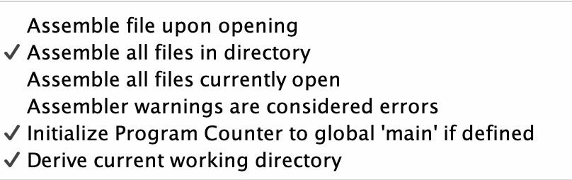

# Хавронич Евгений Алексеевич, БПИ226
---
## Вариант 14
### Условие:
Разработать программу, вычисляющую отдельно число прописных и строчных букв в заданной ASCII–строке. Вывод результатов организовать в файл (используя соответствующие преобразования чисел в строки).
### Программы:
[Программы на ассемблере с комментариями размещены здесь](Files)

Требование перед запуском программ: Должны быть поставлены следующие настройки во вкладке settings, так как используются глобальные метки и графические диалговые окна:

## Программа была написана на оценку 10.

### Требования на 10:
- Программа разбита на несколько единиц компиляции. Программа состоит из несколько единиц компиляции за счёт работы с файлами: основная программа в [Main.asm](Files/Main.asm), подпрограммы [OpenAndWriteFile](Files/OpenAndWriteFile.asm), [OpenForReadFile](Files/OpenForReadFile.asm), [OpenForReadFileUni](Files/OpenForReadFileUni.asm), [OpenForWriteFile](Files/OpenForWriteFile.asm), [ReadAndCount](Files/ReadAndCount.asm), [ReadFile](Files/ReadFile.asm) и библиотека макросов [macrolib.s](Files/macrolib.s).
- Подпрограмма вывода составляет унифицированный модуль, используемый повторно как в программе, осуществляющей ввод исходных данных ([Main.asm](Files/Main.asm)), так и в программах, осуществляющмх тестовые покрытия ([TestProgram.asm](Files/TestProgram.asm) и [TestProgramMacro.asm](Files/TestProgramMacro.asm)). Это было достигнуто при помощи выделения в параметр регистра, которые в зависимости от занесённого числа (0 или 1), предлагает пользователю ввести пути файлов, или изымает из другого регистра параметра путь к строке, которая является путём файла.
- Макросы выделены в отдельную автономную библиотеку [macrolib.s](Files/macrolib.s).
- Используются дополнительные графические диалоговые окна для ввода и отображения диалогов, предоставляемых симулятором RARS (включены в настройках выше)

### Требования на 9:
- Добавлено в программу использование макросов для реализации ввода и вывода данных. Используется библиотека [macrolib.s](Files/macrolib.s), из неё применяются print_int, print_str, WriteInConsole, OpenFileAndReadMacro, CountLetters, ReadAndCount, WriteInt, WriteChar, OpenAndWriteFileMacro.
- Все макросы поддерживают повторное использование с различными массивами и другими параметрами
- WriteInConsole - получает на вход два числа (кол-во прописных и строчных латинских букв) и выводит их в консоль
- OpenFileAndReadMacro – является обёрткой над разработанной ранее подпрограммой OpenForReadFileUni
- CountLetters – подаётся длина строки, сама строка и 2 регистра, куда будут сохраненны количества прописных и строчных латинских букв
- ReadAndCount – является обёрткой над разработанной ранее подпрограммой ReadAndCount
- WriteInt – записывает число(второй параметр) в файл переданного дескриптора(первый параметр)
- WriteChar – записывает переданный символ в файл переданного дескриптора (параметры по аналогии с WriteInt)
- OpenAndWriteFileMacro – является обёрткой над разработанной ранее подпрограммой OpenAndWriteFile
- Реализована дополнительная тестовая программа [TestProgramMacro.asm](Files/TestProgramMacro.asm), которая вызывает выполняемые подпрограммы через макросы, реализуя ту же функциональность, что и предыдущая тестовая программа.

### Требования на 8:
- Добавлена в программу возможность дополнительного вывода результатов на консоль – макрос WriteInConsole(t2, t3). Выводить или нет решает пользователь отвечая «Y» или «N» на соответствующий вопрос компьютерной программы. Данная возможность полезна при быстром отображении коротких данных. Вывод программы при этом должен полностьюсоответствовать выводу результатов в файл.
- Реализована дополнительную тестовая программа которая осуществляет многократный вызов процедур, обеспечивающих ввод файлов, их обработку и вывод для различных исходных данных, расположенных в каталоге с исходными тестовыми данными – [TestProgram.asm](Files/TestProgram.asm). В ней файлы для тестов берутся из папки [InputFiles](Files/InputFiles), а результаты записываются в виде файлов в папке [OutputFiles](Files/OutputFiles)

### Требования на 6-7:
- Внутри функций используются регистровые или локальные (при нехватке) переменные.
- Для чтения текста из файла реализован буфер ограниченного размера, равного 512 байтам. При этом программа читает файлы размером до 10 килобайт.
- Реализован ввод исходных данных, их обработку, вывод результатов через соответствующие подпрограммы.
- Подпрограммы получают необходимые им данные через параметры в соответствии с принятым соглашением о передаче параметров.
- Возвращаемые из подпрограмм значения возвращаются через параметры в соответствии с общепринятыми соглашениями.

### Требования на 4-5:
- Приведено решение программы на ассемблере. Программа из файла читает данные. Результаты записываются в другой файл.
- Все изменяемые параметры программы вводятся с консоли.
- В программе присутствуют комментарии, поясняющие выполняемые ей действия.
- Обработка данных, полученных из файла сформирована в виде отдельной подпрограммы.
- В подкаталоге данных присутствуют файлы, используемые для тестирования.
- Буфер для текста программы имеет фиксированный размер размером не менее 4096 байт, допускающий ввод без искажений только тексты, ограниченные этим размером(сразу использовался буфер по критерию на 6-7 баллов)
- При чтении файла размером, превышающим размер буфера, не происходит падение программы. Программа корректно обрабатывает введенный «урезанный» текст.

## Общий алгоритм программы.
1. Вызов макроса **OpenFileAndReadMacro**. В качестве аргументов получаем регистр, в котором выбран тип ввода пути файла – 0, если из регистра, 1, если пользователем с консоли, а также просто любой регистр(если путь файла вводится пользователем), либо регистр, в котором содержится указатель на строку с путём к необходимому файлу. Возвращает в a0 дескриптор к указанному файлу для чтения (иначе выводит ошибку с неверным путём к файлу в консоль и программа корректно завершается)
Внутри данного макроса вызывается подпрограмма **OpenForReadFileUni**, которая проверяет введённый тип введения пути файла и вызывает подпрограмму **OpenForReadFile**, которая уже возвращает дескриптор на нужный файл.
2. Вызов макроса **ReadAndCount**. В качестве аргумента поступает дескриптор файла, который будет читаться. Возвращает в a0 и a1 количества прописных и строчных латинских букв.
Внутри данного макроса происходи вызов подпрограммы **ReadAndCount**, внутри которой при помощи подпрограммы **ReadFile** читается в цикле по 512 байт файл (максимум 10 кб в итоге), вызывается макрос **CountLetters** от прочитанных 512 байт, где уже подсчитывается количества прописных и строчных латинских букв от буфера. В цикле мы накапливаем количества прописных и строчных латинских букв от буфера.
3. Вызов макроса **WriteInConsole** – принимает на вход количества прописных и строчных латинских букв, спрашивает у пользователя с консоли, вывести ли их в консоль, и выводит, если он вводит Y, если N, то не выводит.
4. Вызов макроса **OpenAndWriteFileMacro**. Действует по аналогии с **OpenFileAndReadMacro**, только для записи файла. Вызывает два раза макрос WriteInt для записи сначала количества прописных букв, а потом количества строчных букв в файл. Между этими вызовами происходи вызов WriteChar, который ставит пробел в файле, чтобы числа не сливались.

## Замечение
Для тестовой программы с подпрограммами алгоритм аналогичен, так как вызываются подпрограммы, вокруг которых обёрнуты макросы из алгоритма выше.
Для чистоты эксперимента в папку 
### Описание метода решения задачи (нахождения корня уравнения методом хорд)

Пусть x1,x2 — абсциссы концов хорды, f(x)=0 — уравнение функции, решаемое методом секущих. Найдём коэффициенты k и b из системы уравнений

Вычтем из первого уравнения второе:

затем найдём коэффициенты k и b:

тогда

Уравнение принимает вид

Таким образом, теперь можем найти первое приближение к корню, полученное методом секущих:

Теперь возьмём координаты x2 и x3 и повторим все проделанные операции, найдя новое приближение к корню. Таким образом, итерационная формула метода секущих имеет вид:

Данную формулу мы и будем использовать для итерационного алгоритма нахождения корня:
xi-ым будет являться a; xi + 1-ым будет являться b.
Как только разница между a и b становится меньше нужной нам точности, то возвращаем b – то есть xi + 1.
### Таблица прогона полного тестового покрытия

<table>
    <tr>
        <th>№ теста</th>
        <th>Какую ситуацию проверяет</th>
        <th>Введённая точность</th>
        <th>Полученный X </th>
    </tr>
    <tr>
        <td>1</td>
        <td>Точность равна правой границе диапозона</td>
        <td>0.001</td>
        <td>1.6048396218292138</td>
    </tr>
    <tr>
        <td>2</td>
        <td>Точность чуть меньше правой границы диапозона</td>
        <td>0.0009</td>
        <td>1.6048396218292138</td>
    </tr>
    <tr>
        <td>3</td>
        <td>Произвольная точность из нужного диапозона</td>
        <td>0.000005</td>
        <td>1.6048428005867157</td>
    </tr>
    <tr>
        <td>4</td>
        <td>Точонсть чуть больше левой границы диапозона</td>
        <td>0.00000002</td>
        <td>1.6048428005867157</td>
    </tr>
    <tr>
        <td>5</td>
        <td>Точность равна правой границе диапозона</td>
        <td>0.00000001</td>
        <td>1.6048427993525602</td>
    </tr>
    <tr>
        <td>6</td>
        <td>Точность меньше правой границы диапозона</td>
        <td>0.000000009</td>
        <td>Accuracy should be in the range of 0.001 to 0.00000001</td>
    </tr>
    <tr>
        <td>7</td>
        <td>Точность больше левой границы диапозона</td>
        <td>0.002</td>
        <td>Accuracy should be in the range from 0.001 to 0.00000001</td>
    </tr>
</table>

